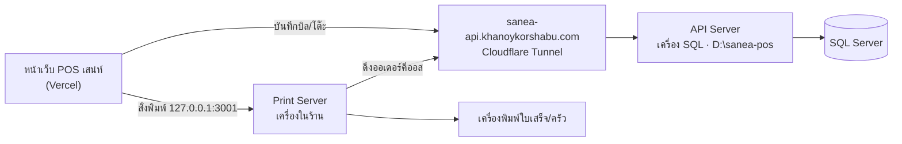

# คู่มือเครื่อง Print Server หลังย้าย API

อัปเดต 2026-09-23

เครื่อง Print Server ในร้านไม่ต้องติดตั้งอะไรเพิ่ม มีงานเดียวคือกดปุ่มในหน้าหลังบ้าน
ให้ระบบพิมพ์ใบครัวอัตโนมัติเปลี่ยนไปใช้ API ตัวใหม่ที่ `sanea-api.khanoykorshabu.com`

## ภาพรวมระบบ

หน้าเว็บ POS บันทึกบิลผ่าน API ที่เครื่อง SQL Server ส่วนการสั่งพิมพ์วิ่งตรงไปที่ Print Server ในร้าน ไม่ผ่านอินเทอร์เน็ต

| เครื่อง | หน้าที่ | ต้องเปิดตลอดไหม |
| --- | --- | --- |
| เครื่อง SQL Server (203.154.185.48) | เก็บข้อมูล + API + Cloudflare Tunnel | ต้องเปิด ถ้าดับ บันทึกบิลไม่ได้ทั้งร้าน |
| เครื่อง Print Server ในร้าน | รับคำสั่งพิมพ์จาก POS และพิมพ์ใบครัวของออเดอร์ที่ลูกค้าสั่งเอง | ต้องเปิดตลอดเวลาที่ร้านเปิด |
| เครื่อง POS / แท็บเล็ต | หน้าขาย | เปิดตอนใช้งาน |

Print Server ทำงาน 2 อย่าง:
1. พิมพ์ใบเสร็จ/ใบครัวที่ POS สั่ง (ไม่เกี่ยวกับ API)
2. คอยดึงออเดอร์ที่ลูกค้าสั่งเองจาก API มาพิมพ์ใบครัวอัตโนมัติ — ส่วนนี้ต้องบอกที่อยู่ API ใหม่

## สิ่งที่ต้องทำที่เครื่อง Print Server (ทำครั้งเดียว)

ทำหลังตั้ง `VITE_API_URL` ใน Vercel และ deploy เสร็จแล้วเท่านั้น

- [ ] เช็กว่าหน้าต่าง Print Server เปิดอยู่ (หน้าต่างดำตัวอักษรเขียว หรือตั้งเปิดอัตโนมัติไว้) ถ้าไม่แน่ใจ เปิด `http://127.0.0.1:3001/health` บนเครื่องนั้น ต้องมีข้อความตอบกลับ
- [ ] บนเครื่อง Print Server เปิดหน้าเว็บ POS แล้วกด **Ctrl+F5** ให้ได้หน้าเว็บรุ่นใหม่
- [ ] เข้า **จัดการหลังบ้าน → ตั้งค่าเครื่องพิมพ์**
- [ ] ถ้ามีกล่องสีเหลือง "⚠️ Print Server ยังชี้ไปที่อยู่เดิม — ใบครัวจะไม่ออก" ให้กด **อัปเดตให้ตรงกันเดี๋ยวนี้** ถ้าไม่มีกล่องนี้ ให้กด **บันทึกการพิมพ์อัตโนมัติ** 1 ครั้ง
- [ ] กล่องสีเหลืองต้องหายไป และปุ่มการพิมพ์อัตโนมัติต้องขึ้นว่า **ปิดการพิมพ์อัตโนมัติ** (แปลว่าเปิดอยู่) ถ้าขึ้นว่า "เปิดการพิมพ์อัตโนมัติ" ให้กดเปิด
- [ ] ทดสอบ: ใช้มือถือสแกน QR สั่งอาหารเอง 1 รายการ ภายใน 20 วินาทีใบครัวต้องออก
- [ ] ทดสอบ: ขายที่หน้า POS 1 บิล ใบเสร็จต้องออก และต้องไม่มีแถบแดง

ไม่ต้องลงโปรแกรมใหม่ ไม่ต้องแก้ไฟล์ในเครื่อง และไม่ต้องตั้ง `.env` บนเครื่อง Print Server
ที่อยู่ API ถูกส่งจากหน้าหลังบ้านและเก็บไว้ในไฟล์ `print-auto-config.json` ในโฟลเดอร์ Print Server เอง

## เช็กทุกเช้าก่อนเปิดร้าน

ใช้เวลาไม่เกิน 1 นาที ถ้าข้อไหนไม่ผ่าน ดูหัวข้อถัดไป

1. เปิดเครื่อง Print Server และเครื่องพิมพ์ทุกเครื่อง
2. เปิด `https://sanea-api.khanoykorshabu.com/api/pos?action=ping` ต้องเห็น `"db":"connected"`
3. หน้า POS เมนูและหมวดหมู่ขึ้นครบ ไม่มีแถบแดงด้านบน
4. หน้าตั้งค่าเครื่องพิมพ์ไม่มีกล่องสีเหลือง และการพิมพ์อัตโนมัติเปิดอยู่

## อาการที่เจอบ่อยและวิธีแก้

| อาการ | สาเหตุ | วิธีแก้ |
| --- | --- | --- |
| แถบแดง "บันทึกบิล … ขึ้นระบบไม่สำเร็จ" | เครื่อง SQL/API ดับ หรือเน็ตร้านหลุด | บิลไม่หาย ระบบส่งซ้ำเองทุก 1.5 นาที อ่านสาเหตุในแถบ แล้วเช็กลิงก์ ping ห้ามล้างข้อมูลเบราว์เซอร์ |
| ลิงก์ ping ขึ้น error 502 หรือ 1033 | API หรือ cloudflared บนเครื่อง SQL ไม่ทำงาน | รีสตาร์ตเครื่อง SQL หรือแจ้งผู้ดูแลระบบ |
| ลิงก์ ping ขึ้น `"db":"error"` | API ทำงานแต่ต่อ SQL Server ไม่ได้ | เช็กเซอร์วิส SQL Server บนเครื่อง SQL |
| ใบเสร็จไม่ออก | Print Server ปิด หรือเครื่องพิมพ์ดับ/กระดาษหมด | ดับเบิลคลิก `start-printer.bat` และเช็กเครื่องพิมพ์ |
| ออเดอร์ที่ลูกค้าสั่งเองไม่ออกใบครัว | Print Server ยังชี้ API เดิม หรือปิดการพิมพ์อัตโนมัติอยู่ | ทำหัวข้อ "สิ่งที่ต้องทำที่เครื่อง Print Server" ซ้ำ |
| หน้าเว็บยังเรียก API เดิม | เบราว์เซอร์จำหน้าเว็บรุ่นเก่า | กด Ctrl+F5 |

ขั้นตอนตั้งค่า Tunnel และ API ฉบับเต็มอยู่ใน [`docs/CLOUDFLARE-TUNNEL.md`](CLOUDFLARE-TUNNEL.md)

## หลายสาขา: ปริ้นเตอร์และหัวใบเสร็จของแต่ละสาขา

แต่ละสาขามีเครื่อง Print Server และปริ้นเตอร์ของตัวเอง การพิมพ์วิ่งในวงแลนของร้าน ไม่ข้ามสาขา

| อะไร | แยกตามสาขาอย่างไร |
| --- | --- |
| รายการปริ้นเตอร์ | หน้า **หลังบ้าน → ปริ้นเตอร์** แสดงและบันทึกเฉพาะของสาขาที่เครื่องนี้ทำงานอยู่ ไม่ทับของสาขาอื่น |
| ใบครัวออเดอร์ลูกค้าสั่งเอง | Print Server ดึงเฉพาะออเดอร์ของสาขาตัวเอง (ที่อยู่ API มี `?branch=` ต่อท้าย) |
| หัวใบเสร็จ | ชื่อร้าน ที่อยู่ เบอร์ เลขผู้เสียภาษี และข้อความท้ายใบ มาจาก **หลังบ้าน → สาขา** |

### ตั้งค่าสาขาใหม่ (ทำที่เครื่องในร้านสาขานั้น)

1. ติดตั้ง Print Server ตามปกติ (`install-autostart.bat`)
2. ล็อกอินด้วยพนักงานของสาขานั้น (หรือพนักงานทุกสาขาแล้วเลือกสาขานั้น)
3. **หลังบ้าน → ปริ้นเตอร์** → ต้องเห็น "🏠 ปริ้นเตอร์ของสาขา: …" ถูกสาขา → เพิ่มปริ้นเตอร์ → บันทึก
4. เปิดการพิมพ์อัตโนมัติ

### หลังอัปเดตระบบเป็นแบบหลายสาขา (ร้านเดิม)

1. **อัปเดตโปรแกรม Print Server** — ต้องทำถึงจะพิมพ์หัวใบเสร็จของสาขาได้ (ไม่อัปเดตก็ยังพิมพ์ได้ แต่หัวใบเป็นข้อความเดิม)
   - โฟลเดอร์ Print Server เชื่อมกับ Git อยู่แล้ว → ดับเบิลคลิก `update-printer.bat`
   - ไม่ได้ใช้ Git → โหลด ZIP จาก GitHub วางทับโฟลเดอร์ แล้วรีสตาร์ตเครื่อง
2. **หลังบ้าน → ปริ้นเตอร์** → ถ้ามีกล่องสีเหลือง "Print Server ยังชี้ไปที่อยู่เดิม" กด **อัปเดตให้ตรงกันเดี๋ยวนี้**
3. **หลังบ้าน → สาขา** → กรอกชื่อร้าน ที่อยู่ เบอร์ เลขผู้เสียภาษี ข้อความท้ายใบ → บันทึก → กลับไปหน้าปริ้นเตอร์กดบันทึกการพิมพ์อัตโนมัติอีกครั้ง (ส่งหัวใบใหม่ให้ Print Server)
4. ทดลองขาย 1 บิล ดูหัวใบเสร็จ
