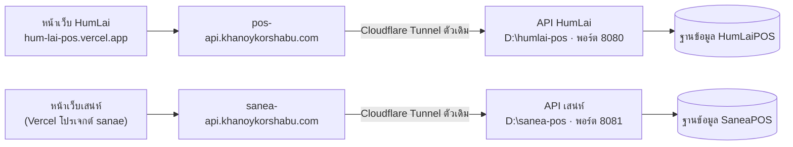

# ย้ายเสน่ห์ไปใช้ SQL Server เครื่องเดียวกับ HumLai (แยกฐานข้อมูล)

คู่มือนี้พาย้ายข้อมูลเสน่ห์จาก Google Sheet ไปอยู่บนเครื่อง SQL Server ที่ HumLai-POS ใช้อยู่แล้ว
โดย**ไม่แตะของ HumLai เลย** ทั้งฐานข้อมูล โปรแกรม API ไฟล์ตั้งค่า และงานที่เปิดอัตโนมัติ

ใช้เวลาประมาณครึ่งวัน (ขั้น 5 ต้องทำตอนร้านเสน่ห์ปิด)

## ภาพรวม



| | HumLai (มีอยู่แล้ว ห้ามแตะ) | เสน่ห์ (สร้างใหม่) |
|---|---|---|
| ฐานข้อมูล | `HumLaiPOS` | `SaneaPOS` |
| บัญชีเข้าฐานข้อมูล | `pos_app` | `sanea_app` |
| โฟลเดอร์โค้ด | `D:\humlai-pos` | `D:\sanea-pos` |
| พอร์ต API | 8080 | 8081 |
| งานเปิดอัตโนมัติ (Task Scheduler) | `HumLai API Server` | `SA-NAE API Server` |
| ที่อยู่ API | `pos-api.khanoykorshabu.com` | `sanea-api.khanoykorshabu.com` |
| รหัสเมนู | `HL00001` … | `SN00001` … |

ทั้งสองร้านใช้ SQL Server และ Cloudflare Tunnel ตัวเดียวกัน แต่ข้อมูล โปรแกรม และการล็อกอินแยกกันทั้งหมด
ถ้า API ร้านหนึ่งล่ม อีกร้านยังขายได้ตามปกติ

## ⚠️ กฎ 3 ข้อตลอดคู่มือนี้

1. **ทำงานในโฟลเดอร์ `D:\sanea-pos` เท่านั้น** อย่าเปิดหรือแก้ไฟล์ใน `D:\humlai-pos`
2. ทุกครั้งที่ใช้ SSMS ให้ดูช่องเลือกฐานข้อมูล (มุมซ้ายบน) ว่าเป็น **`SaneaPOS`** ก่อนกด Execute
3. ถ้าคำสั่งไหนขึ้นชื่อ `HumLai`, `HumLaiPOS` หรือพอร์ต `8080` ให้หยุดก่อน แปลว่ากำลังทำผิดที่

---

## ขั้น 0 — เตรียมก่อนเริ่ม

- [ ] Remote Desktop เข้าเครื่อง SQL ได้ ด้วยบัญชีที่เป็น Administrator
- [ ] เปิด SQL Server Management Studio (SSMS) ด้วยบัญชี `sa` หรือบัญชีที่สร้างฐานข้อมูลได้
- [ ] เข้า Cloudflare (บัญชีที่ดูแลโดเมน `khanoykorshabu.com`) และ Vercel (โปรเจกต์ `sanae`) ได้
- [ ] **Apps Script ของเสน่ห์ deploy ตัวใหม่แล้ว** — เปิด `<URL Apps Script ของเสน่ห์>?action=ping`
      ต้องเห็น `"build":"2026-10-07-sanea-humlai-features"` (ขั้นตอนอยู่ใน README หัวข้อ "ข้อมูลอยู่ที่ไหน")
      สคริปต์ย้ายข้อมูลต้องใช้คำสั่ง `exportSheet` ของตัวนี้
- [ ] ดูว่า HumLai ยังปกติก่อนเริ่ม: เปิด `https://pos-api.khanoykorshabu.com/api/pos?action=ping` ต้องเห็น `"db":"connected"`
      (จะได้รู้ว่าถ้ามีอะไรเสียทีหลัง ไม่ได้เสียมาก่อน)

## ขั้น 1 — สร้างฐานข้อมูล `SaneaPOS`

ใน SSMS กด **New Query** วางทั้งก้อน แล้วแก้รหัสผ่านก่อนกด Execute:

```sql
CREATE DATABASE SaneaPOS;
GO
CREATE LOGIN sanea_app WITH PASSWORD = 'ตั้งรหัสผ่านใหม่ตรงนี้', CHECK_POLICY = ON;
GO
USE SaneaPOS;
CREATE USER sanea_app FOR LOGIN sanea_app;
ALTER ROLE db_owner ADD MEMBER sanea_app;   -- ต้องสร้างตารางได้ตอนรัน sql:init
GO
```

> ใช้บัญชี `sanea_app` แยกจาก `pos_app` ของ HumLai — บัญชีนี้เข้าได้แค่ `SaneaPOS`
> ต่อให้ตั้งค่าผิดในภายหลัง API ของเสน่ห์ก็อ่านหรือลบข้อมูล HumLai ไม่ได้

จดรหัสผ่านไว้ใช้ในขั้น 3 ไม่ต้องตั้งค่า TCP/IP หรือไฟร์วอลล์เพิ่ม เพราะ HumLai เปิดไว้ให้แล้ว

## ขั้น 2 — ดึงโค้ดเสน่ห์ลงเครื่อง

เปิด **Command Prompt (Run as administrator)**:

```bat
cd /d D:\
git clone https://github.com/nookmagazineDev/sanea.git sanea-pos
git config --global --add safe.directory D:/sanea-pos
cd /d D:\sanea-pos
git config credential.useHttpPath true
npm install
```

- ถ้า `git clone` ถามรหัส ให้ใช้ token ของ GitHub ที่เข้า repo `nookmagazineDev/sanea` ได้
  (วิธีสร้าง token และการแยกรหัสไม่ให้ทับของ HumLai อยู่ใน [`UPDATE-API-WITH-GIT.md`](UPDATE-API-WITH-GIT.md)
  `credential.useHttpPath true` คือตัวที่ทำให้เครื่องจำรหัสแยกต่อ repo)
- `npm install` ต้องจบโดยไม่มี `ERR!`

## ขั้น 3 — ตั้งค่าไฟล์ `.env`

```bat
cd /d D:\sanea-pos
copy .env.example .env
notepad .env
```

เปิดไฟล์ `D:\humlai-pos\.env` **แบบอ่านอย่างเดียว** ดูค่า `SQL_SERVER`, `SQL_PORT`, `SQL_ENCRYPT`, `SQL_TRUST_CERT`
แล้วใส่ค่าเดียวกันในไฟล์ของเสน่ห์ (เครื่องเดียวกัน ค่าการเชื่อมต่อเหมือนกัน) ส่วนบรรทัดอื่นแก้ตามนี้:

```ini
SQL_SERVER=<เหมือนของ HumLai>
SQL_PORT=<เหมือนของ HumLai>
SQL_DATABASE=SaneaPOS
SQL_USER=sanea_app
SQL_PASSWORD="รหัสผ่านจากขั้น 1"
SQL_ENCRYPT=<เหมือนของ HumLai>
SQL_TRUST_CERT=<เหมือนของ HumLai>

GAS_EXPORT_URL=<URL Apps Script ของเสน่ห์ ตัวที่ ping แล้วในขั้น 0>

API_PORT=8081
IMAGE_BASE_URL=https://sanea-api.khanoykorshabu.com
```

> **ห้ามคัดลอกไฟล์ `.env` ของ HumLai มาทั้งไฟล์** เพราะจะได้ `SQL_DATABASE=HumLaiPOS` ติดมา
> แล้วเสน่ห์จะไปเขียนทับข้อมูล HumLai
>
> รหัสผ่านที่มีตัว `#` ต้องครอบด้วย `"..."` เสมอ ไม่งั้นจะขึ้น `Login failed for user 'sanea_app'`

## ขั้น 4 — สร้างตาราง

```bat
cd /d D:\sanea-pos
npm run sql:init
```

บรรทัดแรกต้องขึ้นว่า **`เชื่อมต่อ ... / SaneaPOS แล้ว`** ถ้าขึ้น `HumLaiPOS` ให้กด Ctrl+C แล้วกลับไปแก้ `.env`

## ขั้น 5 — ย้ายข้อมูลจาก Google Sheet (ทำตอนร้านปิด)

> บิลที่ขายบน Google Sheet **หลัง**รันขั้นนี้จะไม่ตามมาที่ SQL
> จึงต้องทำตอนร้านปิด และไม่มีใครใช้หน้าขายจนกว่าจะจบขั้น 8

```bat
cd /d D:\sanea-pos
npm run sql:migrate
```

รอบแรกเป็นการดูอย่างเดียว ยังไม่เขียนอะไร จะเห็นจำนวนแถวของแต่ละชีต
ชีต `Branches`, `MenuBranch`, `TaxInvoices`, `TaxCustomers`, `KioskPayments` ขึ้นว่า "ยังไม่มีชีตนี้ ข้าม" ได้
(แปลว่าร้านยังไม่เคยใช้ฟีเจอร์นั้น) ถ้าตัวเลขดูถูกต้อง ให้ย้ายจริง:

```bat
npm run sql:migrate -- --write
npm run sql:init
npm run sql:renumber
npm run sql:renumber -- --write
```

| คำสั่ง | ทำอะไร |
|---|---|
| `sql:migrate -- --write` | คัดลอกทุกชีตเข้า SaneaPOS (ล้างตารางปลายทางก่อน จึงรันซ้ำได้) |
| `sql:init` **อีกรอบ** | สร้างสาขาจากชื่อสาขาของพนักงาน ถ้ายังไม่มี และผูกบิล/โต๊ะ/ยอดชำระเดิมเข้าสาขาหลัก — **ห้ามข้าม** ไม่งั้นโต๊ะที่เปิดอยู่และบิลเก่าจะไม่ขึ้นในหน้าขาย |
| `sql:renumber` | ดูตารางเทียบรหัสเมนูเก่า → `SN00001` |
| `sql:renumber -- --write` | เปลี่ยนรหัสจริง พร้อมแก้ทุกที่ที่อ้างถึง (BOM, ส่วนลด, ปริ้นเตอร์, เมนูรายสาขา) |

รูปเมนูเดิมที่อยู่บน Google Drive ยังเปิดได้เหมือนเดิม ส่วนรูปที่อัปโหลดใหม่หลังจากนี้จะเก็บใน SQL

## ขั้น 6 — เปิด API ของเสน่ห์

ทดลองเปิดแบบเห็นหน้าต่างก่อน:

```bat
cd /d D:\sanea-pos
start-api.bat
```

บนเครื่องเดียวกัน เปิดเบราว์เซอร์ไปที่ `http://localhost:8081/api/pos?action=ping` ต้องเห็น

- `"db":"connected"`
- `"database":"SaneaPOS"`
- `"menuRows":` เป็นจำนวนเมนูของเสน่ห์ ไม่ใช่ของ HumLai

ถ้าถูกต้อง ปิดหน้าต่าง `start-api.bat` แล้วตั้งให้เปิดเองทุกครั้งที่เปิดเครื่อง:

คลิกขวา `D:\sanea-pos\install-api-autostart.bat` → **Run as administrator**

ตรวจใน **Task Scheduler** ว่ามีงานครบ**ทั้งสองตัว**คือ `HumLai API Server` และ `SA-NAE API Server`
แล้วเปิด `http://localhost:8080/api/pos?action=ping` ดูว่า HumLai ยังตอบ `"database":"HumLaiPOS"` ตามปกติ

## ขั้น 7 — เพิ่มที่อยู่ `sanea-api` ใน Cloudflare Tunnel ตัวเดิม

ไม่ต้องติดตั้ง cloudflared ใหม่ แค่เพิ่มปลายทางอีกอันใน tunnel ที่ HumLai ใช้อยู่

**ถ้า tunnel จัดการบนหน้าเว็บ:**
<https://one.dash.cloudflare.com> → **Networks → Tunnels** → tunnel ตัวเดิม → **Public Hostname → Add a public hostname**

| ช่อง | ใส่ |
|---|---|
| Subdomain | `sanea-api` |
| Domain | `khanoykorshabu.com` |
| Type | `HTTP` |
| URL | `localhost:8081` |

**ถ้าขึ้นว่า "This tunnel is locally managed":** ต้องแก้ไฟล์ `config.yml` ในเครื่องแทน
โดยเพิ่ม 2 บรรทัดใต้กฎของ `pos-api` และต้องอยู่**ก่อน**บรรทัด `http_status:404`:

```yaml
ingress:
  - hostname: pos-api.khanoykorshabu.com      # ของ HumLai — ห้ามแก้
    service: http://localhost:8080
  - hostname: sanea-api.khanoykorshabu.com    # ← เพิ่ม
    service: http://localhost:8081            # ← เพิ่ม
  - service: http_status:404
```

ต่อด้วย validate → สร้าง DNS → รีสตาร์ตเซอร์วิส ตามขั้นในหัวข้อ "This tunnel is locally managed" ของ
[`CLOUDFLARE-TUNNEL.md`](CLOUDFLARE-TUNNEL.md) โดยใช้ชื่อ `sanea-api.khanoykorshabu.com` แทน
(YAML เว้นวรรคผิดช่องเดียว `pos-api` ของ HumLai จะดับไปด้วย จึงต้อง validate ก่อนรีสตาร์ตทุกครั้ง)

ทดสอบจากมือถือที่ใช้เน็ตมือถือ (ไม่ใช่ Wi-Fi ร้าน):

- `https://sanea-api.khanoykorshabu.com/api/pos?action=ping` → `"database":"SaneaPOS"`
- `https://pos-api.khanoykorshabu.com/api/pos?action=ping` → `"database":"HumLaiPOS"` (HumLai ยังปกติ)

## ขั้น 8 — สลับหน้าเว็บเสน่ห์มาใช้ API ใหม่

Vercel → โปรเจกต์ **sanae** → **Settings → Environment Variables** → Add:

| Key | Value | Environments |
|---|---|---|
| `VITE_API_URL` | `https://sanea-api.khanoykorshabu.com/api/pos` | Production, Preview |

จากนั้นไปที่ **Deployments** → deployment ล่าสุด → **⋯ → Redeploy**
(ค่า `VITE_` ถูกฝังตอน build ถ้าไม่ redeploy หน้าเว็บจะยังเรียก Google Sheet อยู่)

> **ไม่ต้อง**ใส่ค่า `SQL_*` ใน Vercel — เครื่อง SQL อยู่หลัง tunnel และหน้าเว็บคุยผ่าน `sanea-api` อย่างเดียว

## ขั้น 9 — ตรวจหลังสลับ

ที่เครื่องหน้าร้านเสน่ห์ กด **Ctrl+F5** ก่อน แล้วไล่ตรวจทีละข้อ:

- [ ] ล็อกอินด้วยรหัสพนักงานเดิมได้
- [ ] เมนูและหมวดหมู่เป็นของเสน่ห์ครบ (ไม่มีเมนูข้าวมันไก่ปน)
- [ ] โต๊ะที่เปิดค้างไว้จาก Google Sheet ยังขึ้น
- [ ] เปิดโต๊ะ → สั่งอาหาร → ส่งครัว → ชำระเงิน ได้ และใบเสร็จออก
- [ ] หลังบ้าน > รายงาน เห็นยอดขายของวันก่อน ๆ
- [ ] **Print Server ที่ร้าน:** หลังบ้าน → ตั้งค่าเครื่องพิมพ์ → ถ้ามีกล่องเหลือง "Print Server ยังชี้ไปที่อยู่เดิม" ให้กด
      **อัปเดตให้ตรงกันเดี๋ยวนี้** (รายละเอียดใน [`PRINT-SERVER-AFTER-API-MOVE.md`](PRINT-SERVER-AFTER-API-MOVE.md))
- [ ] ใช้มือถือ (เน็ตมือถือ) สแกน QR โต๊ะ สั่งเอง 1 รายการ แล้วใบครัวต้องออกภายใน 20 วินาที
- [ ] หลังบ้าน → สาขา: ใส่ชื่อร้าน ที่อยู่ เลขผู้เสียภาษี และ POS ID ให้ครบ (ใช้บนใบกำกับภาษี)
- [ ] เปิดหน้าเว็บ HumLai ขายได้ตามปกติ

## ถอยกลับไป Google Sheet (ถ้ามีปัญหา)

Vercel → โปรเจกต์ sanae → ลบ `VITE_API_URL` → Redeploy หน้าเว็บจะกลับไปใช้ Google Sheet ทันที

> บิลที่ขายบน SQL ระหว่างนั้น**จะไม่อยู่ใน Google Sheet** ต้องจดยอดไว้ หรือย้ายกลับเอง
> จึงควรตัดสินใจถอยภายในวันแรก

## อัปเดตโค้ดเสน่ห์ภายหลัง

คลิกขวา `D:\sanea-pos\update-api.bat` → **Run as administrator**
(ดึงโค้ดล่าสุดของ sanea → อัปเดตตาราง → รีสตาร์ตเฉพาะ `SA-NAE API Server` ไม่กระทบ HumLai)

## อาการที่เจอบ่อย

| อาการ | สาเหตุ / วิธีแก้ |
|---|---|
| `sql:init` ขึ้นว่าเชื่อมต่อ `HumLaiPOS` | `.env` ผิดไฟล์หรือผิดค่า → แก้ `SQL_DATABASE=SaneaPOS` ใน `D:\sanea-pos\.env` |
| `Login failed for user 'sanea_app'` | รหัสผ่านผิด หรือมี `#` แต่ไม่ได้ครอบ `"..."` |
| `EADDRINUSE ... 8081` | API ของเสน่ห์เปิดซ้อนอยู่แล้ว (เช่น เปิด `start-api.bat` ค้างไว้) → ปิดหน้าต่างนั้น |
| `EADDRINUSE ... 8080` | `.env` ไม่มี `API_PORT=8081` → เพิ่มบรรทัดนี้ (8080 เป็นของ HumLai) |
| ping ผ่าน `localhost:8081` แต่ผ่าน `sanea-api...` ไม่ได้ | ขั้น 7 ยังไม่ครบ (ไม่ได้รีสตาร์ต cloudflared หรือ DNS ยังไม่ขึ้น) |
| `pos-api` ของ HumLai ดับหลังแก้ `config.yml` | YAML ผิด → เอาสองบรรทัดที่เพิ่มออก validate แล้วรีสตาร์ต แล้วค่อยเพิ่มใหม่อย่างระวัง |
| หน้าขายไม่เห็นโต๊ะ/บิลเดิม | ข้าม `sql:init` รอบสองในขั้น 5 → รัน `npm run sql:init` ที่ `D:\sanea-pos` |
| หน้าเว็บยังเรียก `script.google.com` | ตั้ง `VITE_API_URL` แล้วแต่ยังไม่ได้ Redeploy |
| ใบครัวจากคีออสไม่ออก | Print Server ยังชี้ API เดิม → ทำข้อ Print Server ในขั้น 9 |
